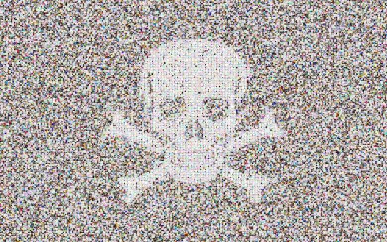

# gh-dmca

Code from TLAPD 2018's post : <https://rud.is/b/2018/09/19/taking-a-tour-of-the-pirate-ship-github-dmca-with-r/>

## Prerequisites

    $ cd YOUR_DATA_DIR
    $ git clone git clone git@github.com:github/dmca.git
    

